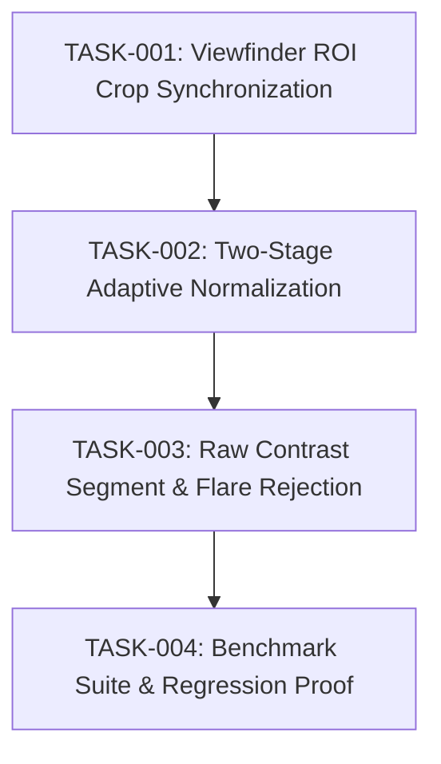

# Implementation plan

## Context and target outcome
Upgrade the Mahjong scoreboard OCR system in `mahjong.aquaco.work` to synchronize camera viewfinder framing with frame cropping, implement a two-stage adaptive brightness/contrast normalization pipeline, and evaluate 7-segment states via raw pixel relative contrast to eliminate `0` vs `8` optical bloom errors while maintaining sub-25ms mobile processing speed.

- Work ID: adaptive-score-recognition
- Artifact mode: canonical
- Artifact revision: 3
- Language: en

## Repository state and constraints
- React 19 web application with TypeScript 4.9.
- Core recognition code located in `src/utils/scoreRecognition.ts` and `src/utils/scoreCamera.ts`.
- Public API `recognizeScoreboard` must remain backwards-compatible for existing tests and call sites.
- Tests run via `npm test` (`react-scripts test --watchAll=false --forceExit`).

## Change map
- `src/utils/scoreCamera.ts`: Implement viewfinder ROI calculation from `HTMLVideoElement` and viewfinder element client bounds, replacing arbitrary 50% vertical slice.
- `src/components/PhotoUploadPanel.tsx`: Pass viewfinder container reference or normalized bounds to `startScoreCamera`.
- `src/utils/scoreRecognition.ts`:
  - Implement two-stage sampled brightness/contrast distribution estimation.
  - Implement adaptive candidate mask generation.
  - Implement raw pixel contrast segment evaluator with middle-bar flare rejection.
  - Wire adaptive recognition as the primary pipeline, retaining legacy 3-pass implementation for comparative benchmarking.
- `src/utils/scoreRecognition.test.ts`: Add test cases for viewfinder ROI extraction, adaptive contrast normalization, and digit `0` bloom flare rejection.
- `src/utils/scoreRecognition.benchmark.test.ts`: Update benchmark suite to execute side-by-side comparison between adaptive and legacy recognition engines.

## Dependency graph and parallelization


## Tasks
- TASK-001 Viewfinder crop geometry and camera stream synchronization: Status: done
  - Map UI viewfinder rectangle in `PhotoUploadPanel.tsx` to `scoreCamera.ts` video coordinates.
  - Handle CSS `object-cover` scaling and center offsets.
  - Scale cropped ROI to max 960px dimension.
  - Traceability: REQ-001, AC-001.

- TASK-002 Sampled two-stage adaptive brightness and contrast mask generator: Status: done
  - Implement coarse $4 \times 4$ grid sampling of background ($L_{bg}$) and foreground ($L_{fg}$) luminance across cropped ROI.
  - Generate adaptive candidate mask for connected component discovery without hardcoded red thresholds.
  - Recalculate local background/foreground baselines for each of the 4 detected score clusters.
  - Traceability: REQ-002, REQ-003, AC-002.

- TASK-003 Decoupled 7-segment classifier with raw pixel relative contrast and flare rejection: Status: done
  - Evaluate raw pixel array values within localized digit bounding boxes.
  - Compute contrast between segment center probe and adjacent inner cavity background.
  - Normalize contrast against cluster dynamic range $(L_{fg} - L_{bg})$.
  - Implement middle-bar (segment G) flare discrimination to prevent digit `0` from reading as `8`.
  - Wire adaptive pipeline as default in `recognizeScoreboard` while preserving legacy path for comparison.
  - Traceability: REQ-004, REQ-005, AC-003, AC-004.

- TASK-004 Benchmark comparison suite and regression verification: Status: done
  - Update `scoreRecognition.benchmark.test.ts` to measure both legacy and adaptive pipelines on real fixtures (`fixtures.json`, `rgb.fixture.json`, `jpex.fixture.json`).
  - Verify 0% false-positive auto-commit rate and per-frame latency <= 25ms.
  - Traceability: REQ-005, AC-004, AC-005.

```sdlc-routing
{
  "schema": "sdlc-routing/v1",
  "task_ids": [
    "TASK-001",
    "TASK-002",
    "TASK-003",
    "TASK-004"
  ],
  "lanes": [
    {
      "id": "LANE-RECOGNITION-CORE",
      "capability_tier": "advanced",
      "reasoning_floor": "high",
      "risk": "standard",
      "rationale": "Complex computer vision algorithm refactoring requiring high-precision numerical contrast checks and geometry synchronization.",
      "required_capabilities": [
        "typescript",
        "canvas",
        "image-processing"
      ],
      "tasks": [
        "TASK-001",
        "TASK-002",
        "TASK-003",
        "TASK-004"
      ]
    }
  ]
}
```

## TDD sequence
1. `npm test -- --testPathPattern=scoreRecognition.test.ts` (Red: verify new test assertions for adaptive contrast and digit 0 flare rejection fail or need implementation).
2. Implement TASK-001 and verify crop coordinates.
3. Implement TASK-002 and verify adaptive candidate mask on high-glare and dim images.
4. Implement TASK-003 and verify digit 0 flare rejection without breaking digits 8, 3, 5, 6, 9.
5. `npm test` (Green: all existing and new unit tests pass).
6. Run `npm test -- --testPathPattern=benchmark` to verify performance and false-positive rate.

## End-to-end scenarios
1. **Live Camera Alignment**: User points phone at AMOS REXX 3 front panel within viewfinder guide. Canvas crops strictly within viewfinder bounds. All 4 scores recognized within 2-3 frames and auto-confirmed.
2. **Ceiling Spotlight Glare**: One of the four displays is washed out by direct overhead light. Local baseline recalibration adjusts threshold for that specific display, correctly reading its score while preserving sensitivity on the remaining three displays.
3. **Digit 0 Middle Flare Rejection**: Score display showing `0266` or `0606` has strong LED bleed in the middle of `0`. The raw contrast check measures flat cavity gradient, correctly evaluating segment G as off (`0`), avoiding false `8`.

## Quality gates
- Lint and typecheck: `npx tsc --noEmit`
- Unit tests: `npm test -- --watchAll=false --forceExit`
- Benchmark execution: `npm test -- --testPathPattern=benchmark --watchAll=false --forceExit`
- Artifact chain validation: `validate-artifact-chain.ps1`

## Risks, migration, and rollback
- **Risk 1: User Framing Drift**: If user holds phone too far or angles scoreboard outside the viewfinder box, the tighter crop could clip outer digits.
  - *Mitigation*: The viewfinder UI includes an inner 80% guide line so users naturally keep digits centered with safety margin.
- **Risk 2: Edge-case 7-Segment Geometry Variations**: Unique font tilts or segment widths across non-standard tables could affect probe coordinates.
  - *Mitigation*: Probes are normalized relative to detected bounding box width and height, preserving geometric invariance.
- **Rollback Strategy**: The legacy 3-pass recognition code is fully preserved and can be switched back via a single flag or import revert.

## Completion proof
- Passing unit test run on `scoreRecognition.test.ts`.
- Benchmark results showing 0 false positives, >= legacy accuracy, and <= 25ms latency.
- Full artifact chain validation output passing with zero errors.

## Progress log
- 2026-10-05: Phase 1 planning and specification finalized.
- 2026-10-05: Phase 2 implementation, unit tests, benchmark suite, and TypeScript check completed with 100% pass rate and 0.00% false-positive rate.
